# Application Startup Flow

```mermaid
flowchart TD
    Start([Application Start])

    subgraph External [External Sources]
        Settings[Load .env file]
        ConfigPy["app/bootstrap/config.py<br>BaseSettings.load()"]
    end

    subgraph DB_Init [Database Initialization]
        DB_URL[Read database_url from settings]
        EngineDB["create_engine(DB_URL)<br>SQLite connection pool"]
        SessionFactory["sessionmaker(bind=Engine)"]
    end

    subgraph Auth_Init [Auth Provider Initialization]
        AuthTypeCheck{"auth_provider == 'mock'?"}
        MockStub["MockAuthProvider()<br>Load default identities dict"]
        FirebaseStub["Firebase.initializeApp()"]
    end

    subgraph StateSetup [App State]
        AppState1[app.state.settings]
        AppState2[app.state.engine]
        AppState3[app.state.session_factory]
        AppState4[app.state.auth_provider]
    end

    subgraph RouterRegistration [Router Registration]
        Health["include_router(health)<br>GET /health"]
        AuthRouter["include_router(auth)<br>GET /auth/me, /auth/admin-check"]
        Users["include_router(users)<br>GET /users/me, PATCH /users/me"]
    end

    Ready([Ready — Listening for Requests])

    Start --> Settings
    Settings --> ConfigPy
    ConfigPy --> AppState1
    ConfigPy --> DB_URL
    DB_URL --> EngineDB
    EngineDB --> SessionFactory
    EngineDB --> AppState2
    SessionFactory --> AppState3
    ConfigPy --> AuthTypeCheck
    AuthTypeCheck -->|mock| MockStub
    AuthTypeCheck -->|firebase| FirebaseStub
    MockStub --> AppState4
    FirebaseStub --> AppState4
    AppState1 --> Ready
    AppState2 --> Ready
    AppState3 --> Ready
    AppState4 --> Ready
    Ready --> Health
    Ready --> AuthRouter
    Ready --> Users

    style Start fill:#000,stroke:#fff,stroke-width:2px
    style External fill:#e1f5fe,stroke:#1565c0,stroke-width:1px
    style DB_Init fill:#e3f2fd,stroke:#3369ff,stroke-width:1px
    style Auth_Init fill:#ffebee,stroke:#ff6e40,stroke-width:1px
    style StateSetup fill:#fff8e1,stroke:#f9a825,stroke-width:1px
    style RouterRegistration fill:#e8f5e9,stroke:#43a047,stroke-width:1px
    style Health fill:#000,stroke:#2e7d32,stroke-width:1px
    style AuthRouter fill:#000,stroke:#c62828,stroke-width:1px
    style Users fill:#000,stroke:#f9a825,stroke-width:1px
    style Ready fill:#e151e0,stroke:#2e7d32,stroke-width:2px
```

**Explanation of Startup Flow:**

1. **Load Configuration**
   - `Settings` class reads environment variables
   - `app_name`, `database_url`, `auth_provider` are loaded
   - LRU cache ensures settings loaded once per process

2. **Initialize Database**
   - `create_engine()` creates SQLite connection pool
   - `sessionmaker` creates session factory
   - Both stored in `app.state` for dependency injection

3. **Select Auth Provider**
   - If `auth_provider == "mock"`: `MockAuthProvider()` (dev mode)
   - If `auth_provider == "firebase"`: `FirebaseAuthProvider()` (prod)
   - Initialized and stored in `app.state.auth_provider`

4. **Register Routers**
   - `health.router` — Health check endpoint
   - `auth.router` — Authentication endpoints
   - `users.router` — User endpoints

5. **Wait for Requests**
   - `uvicorn` or similar ASGI server listens for incoming HTTP requests
   - FastAPI waits for client requests

**Key Points:**
- Everything is cached (DB engine, session factory, settings) for performance
- Auth provider selected at startup based on config
- No external connections (Firebase) made until first request
- Routers included — FastAPI handles routing to appropriate endpoint