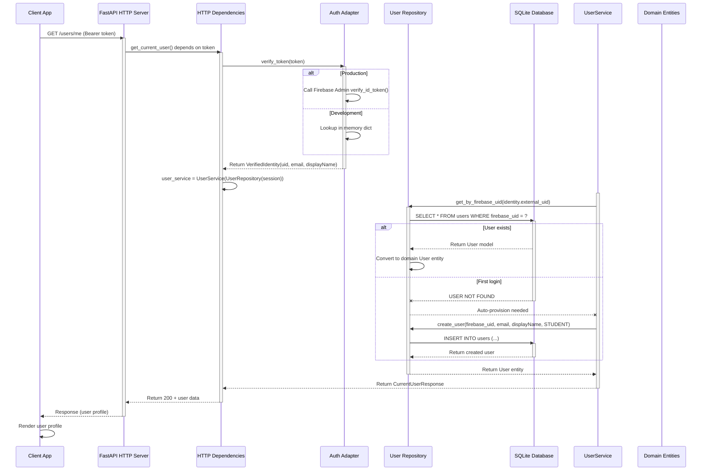
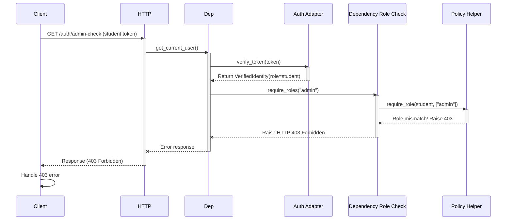

# Client Request Flow

# Alternative: Forbidden Response (wrong role)

**Legend:**
- **Solid arrow** `->>` → Normal call / request
- **Dashed arrow** `-->>` → Response / return
- **Cross arrow** `--x` → Error / exception path
- **alt** → Alternative path based on condition
- **activate/deactivate** → Show lifecycle of components